# Petalburg Dynasty

You beat the Elite Four. Now you run Petalburg Gym.

A career sim built on Pokémon Emerald.

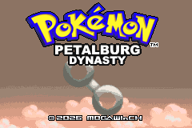

## Install

You need your own copy of **Pokémon Emerald (USA, Europe), revision 0**.

| | |
| --- | --- |
| md5 | `605b89b67018abcea91e693a4dd25be3` |
| size | 16,777,216 bytes |

Apply `petalburg-dynasty-1.0.bps` to it with any BPS patcher:

- [Flips](https://www.romhacking.net/utilities/1040/) on desktop
- [rom-patcher.js](https://www.marcrobledo.com/RomPatcher.js/) in a browser, nothing to install

The patch is useless without your own ROM. No ROM is distributed here.

## Notable features

- You are Emerald's Champion and Norman resigns and hands you Petalburg Gym.
- Pick your gym's type
- 48 challengers every seasons with teams generated and authored for challenging matches.
- Climb the Gym ladder rank until you reach the top.
- Fainting can cost an injury, and an injured Pokémon misses the next match day.
- Hire staff, build facilities, scout challengers and pay for training.
- Book expeditions to travel across the region and more.
- More surprise!

## Difficulty

- Can be hard on purpose.
- Your type choice affect the difficulty setting.
- Every challenger is built and have more in more resources. By example, Aces bring six Pokémon, full EVs and Full Restores.
- No grinding. XP comes only from match days, paid training and six encounters per match day.
- Money is tight.
- You can finish a season badly and be relegated.

## Who it is for

- People who finished Emerald and want the next chapter.
- People who like management and career sims.
- People who want a different Emerald experience without a randomizer or self-imposed rules.
- Not for you if you want an overworld journey, badges, or a story to walk through.

## Screenshots

| | |
| --- | --- |
| 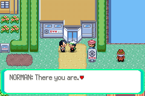 | 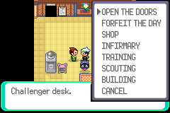 |
| 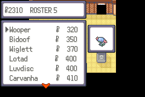 | 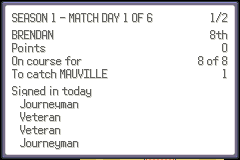 |
| 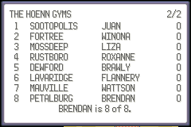 | 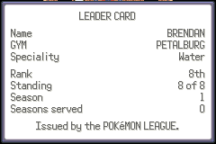 |
| 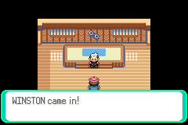 | 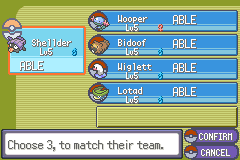 |
| 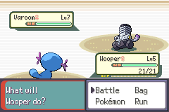 | 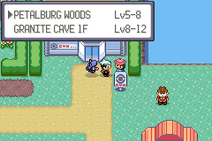 |

## Bugs and feedback

Open an issue on this repository. Balance feedback is wanted as much as bug reports: if a rank felt unfair, say which rank and which type you picked.

## Credits

- **pret** - the pokeemerald decompilation.
- **RH Hideout** - pokeemerald-expansion 1.16.4, the base this is built on, and everyone in its contributor list.
- **Pokemon Heart & Soul** - Lil Dill, TixoRebel, InfiniteBacon42, Exclsior, Phantonomy, DaniRainbow.
- Crystal Advance (Kertra), Ekat99, TheDeadHeroAlistair, the Johto Redrawn Team.
- Crystal Advance (Kertra), Fire Gold (blackfragrant), SkidMarc25.
- **Gold and Silver Generation 3 Decomp** - smithk200.
- HnS Dev Team, RH Hideout, NecroDingo and Jaizu.

Pokémon is Nintendo, Creatures and Game Freak's. This is a free fan patch and is not affiliated with them.
